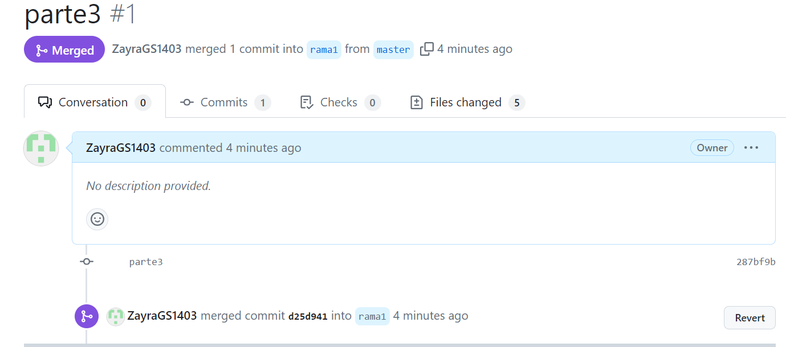
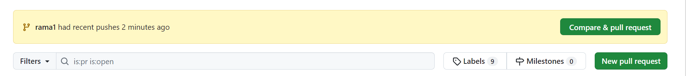

 # LABORATORIO 01
“INTEGRANTES
Andres Serrato
Zayra Gutierrez

 ### PARTE I (Trabajo Individual).
1. Crea un repositorio localmente.
  

2. Agrega un archivo de ejemplo al repositorio, el README.md puede ser una gran opción.

3. Averigua para qué sirve y como se usan estos comandos git add y git commit -m “mensaje”

git add: Mueve los cambios del directorio de trabajo al área del entorno de ensayo

git commit: captura una instantánea de los cambios preparados en ese momento del proyecto.

4. Abre una cuenta de github, si ya la tienes, enlazala con el correo institucional

5. Crea un repositorio en blanco (vacío) e GitHub.

6. Configura el repositorio local con el repositorio remoto.

git commit -m "first commit"

7. Sube los cambios, teniendo en cuenta lo que averiguaste en el punto 3 Utiliza los siguientes comando en el directorio donde tienes tu proyecto.

8. Configura el correo en git local de manera correcta

9. Vuelve a subir los cambios y observa que todo esté bien en el repositorio remoto (en GitHub).
dsad

Todo esta perfecto en el repositorio.

### Parte II (Trabajo en Parejas)

1. Se escogen los roles para trabajar en equipo, una persona debe escoger ser "Owner" o Propietario del repositorio y la otra "Collaborator" o Colaborador en el repositorio.

el owner será el repositrio de Zayra y el colaborador será Andres.

2. El owner agrega al colaborador con permisos de escritura en el repositorio que creó en la parte 1

4. El colaborador acepta la invitación al repositorio

 

5. Owner y Colaborador editan el archivo README.md al mismo tiempo e intentan subir los cambios al mismo tiempo.

6. que sucedio ?
salto el siguiente error que genero un conflicto de la fusion con la linea de comando

8. Volver a repetir un cambio sobre el README.md ambas personas al tiempo para volver a tener conflictos.

9. Resuelvan el conflicto con IntelliJ si es posible, Resolver conflictos en Visual

### PARTE III (Trabajo de a parejas)

1. ¿Hay una mejor forma de trabajar con git para no tener conflictos?
Si, utilizando las ramas se evitan los conflictos o haciendo pull request.

2. ¿Qué es y como funciona el Pull Request?

Un pull request es una petición que el propietario de un fork de un repositorio hace al propietario del repositorio original para que este último incorpore los commits que están en el fork. En el caso que nos ocupa, el usuario  le enviará la petición  para que este último incorpore los commits que tiene en su fork.

3. Creen una rama cada uno y suban sus cambios
   

4. Tanto owner como colaborador hacen un cambio en el README.md y hacen un Pull Request (PR) a la rama main/master

5. Teniendo en cuenta la recomendación, mezclen los cambios a la rama main a través de PR con el check/review/approval del otro compañero (Cuando se hace merge se deberían borrar las ramas en github)

